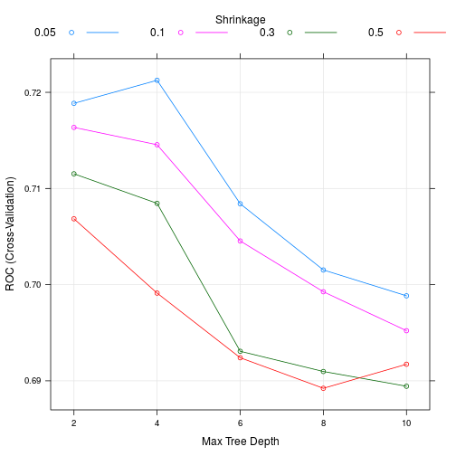

## Introduction
 
This work is the week 4 assignment for the Data Products course by Johns Hopkins University on Coursera, as part of their Data Science Specialization. You can find more about it <a href="https://www.coursera.org/specializations/jhu-data-science">here</a>.   
 
# Starting with XGBoost for Classification

 

The app built as a result of this assignment is a simple Shiny App to help you start with XGBoost for classification problems. XGBoost is a famous implementation of the gradient boosting frame. It is widely used amongst the community, and usually yields great results.

 

You can find more about XGBoost <a href="https://xgboost.readthedocs.io/en/latest//">here</a>

 

This app allows you to train a predictor using the XGBoost package and the caret package. It allows you to tune your XGBoost model and select the best model using cross-validation (10 fold). 

---

## Walkthrough
 
# Choose your dataset
 
First you have to choose a dataset. You can either upload your own dataset or choose between the two available datasets. The current available datasets are the <a href="https://github.com/paulhendricks/titanic">Titanic dataset</a> and the <a href="https://stat.ethz.ch/R-manual/R-devel/library/datasets/html/iris.html">Iris dataset</a>.

 
Be careful to not use a super large dataset, this is just an introduction so the app is not fit to run on large datasets.

 
After uploading your dataset, you will be prompted to choose your target column. This is the column your model will try to predict. Then, you will have to choose the features your model will use to predict your target column.

--- 

## Tuning parameters

After choosing your dataset you will have to set the parameters to be tuned. Since this is just an introduction to XGBoost you will only have the option to tune 3 parameters, you will have to fix one parameter and choose possible values for the others.
 They are:
 
* **Max Depth**: Maximum depth of a tree, increase this value will make the model more complex / likely to be overfitting.

* **Number of Rounds**: This is the number of iterations the boosting algorithm will go through. Increase this value will make the model likely to be overfitting.

* **Learning Rate**: Step size shrinkage used in update to prevents overfitting. After each boosting step, we can directly get the weights of new features, and the learning rate actually shrinks the feature weights to make the boosting process more conservative.

 
The result of the model tuning will be a graph showing the metric (ROC for binary classification and Accuracy for multi-class) as a function of the parameters.

---

# Example

Let's see how it works for the Titanic dataset. We will try to predict if a person would survive based on her age, sex and class.

